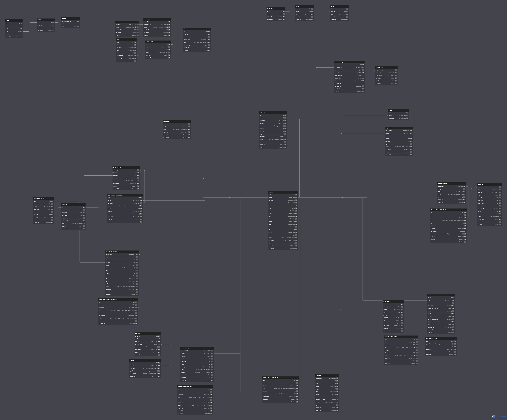

## Database Schema

#### ERD

## Logging System

The application uses Winston for logging with the following features:

- **Log Rotation**: Logs are rotated daily using winston-daily-rotate-file
- **Log Levels**: Different log levels based on environment (development/production)
- **Log Storage**: All logs are stored in the `logs` directory
- **HTTP Logging**: All HTTP requests are logged with method, URL, status code, and response time
- **Error Logging**: Errors are logged separately in error-specific files

### Log Files

- **Application Logs**: `logs/application-YYYY-MM-DD.log` - Contains all logs
- **Error Logs**: `logs/error-YYYY-MM-DD.log` - Contains only error logs

### Commands

- `npm run dev` - Run the app in development mode
- `npm run start:prod` - Run the app in production mode
- `npm run logs:clean` - Clean all log files
